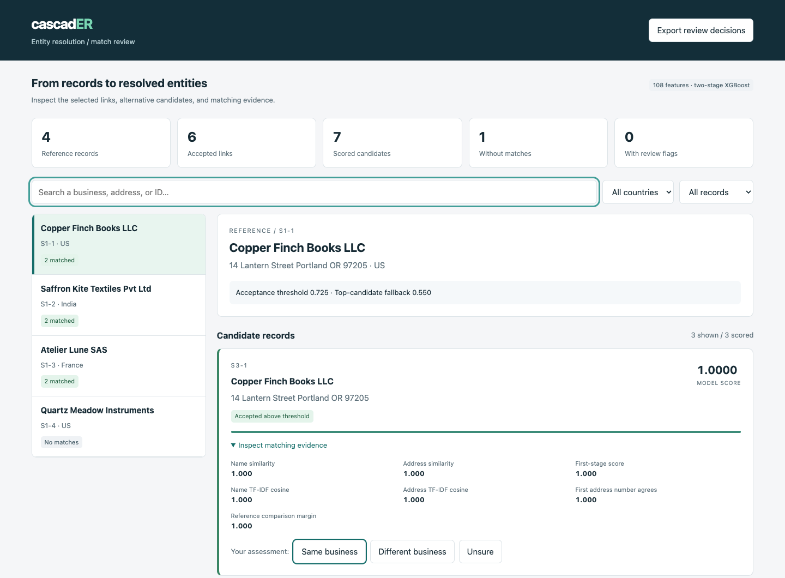
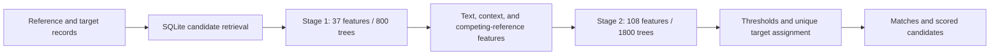

# cascadER

### Two-stage XGBoost for business entity resolution

cascadER links noisy business records to a deduplicated reference catalog. It combines
name and address retrieval, multilingual text comparisons, and two trained XGBoost
classifiers. Each reference can match zero, one, or many records.

Run a local batch, inspect its decisions in a browser, and export human review labels.
The repository includes trained weights, a reproducible synthetic stress test,
matching baselines, and tests for the scoring and assignment rules.



**Internal validation: 0.97224 macro F₀.₅ across 11,199 held-out references.**
This is a precision-focused matching score. The original evaluation data is not
distributed, so this result is not independently reproducible from the demo.

## How it works



- **Candidate retrieval:** up to 80 candidates per reference using names, addresses,
  numeric tokens, compact strings, and phonetic hints.
- **Two-stage matching:** initial probabilities become inputs to a richer classifier.
  Training uses group out-of-fold predictions to reduce stacking leakage.
- **Text features:** local transliteration, fuzzy comparisons, character TF-IDF,
  address numbers, and support from neighboring candidates.
- **Competing references:** each target is compared with other plausible reference
  records; final assignment gives a target to at most one reference.
- **Local execution:** CPU workers, SQLite indexes, and resumable prediction batches.

This is a trained and tuned gradient-boosted system. Both classifiers were trained
from scratch; there are no pretrained neural weights.

## Quick start

Python 3.12; tested on macOS with 16 GB memory. On macOS, install OpenMP with
`brew install libomp` if it is not already available.

```sh
git clone https://github.com/BharZInstein/cascadER.git
cd cascadER
python3.12 -m venv .venv
source .venv/bin/activate
pip install -r requirements.txt
python scripts/run_demo.py
```

The demo uses fictional records and the included trained models. It builds indexes,
scores candidates, resolves competing assignments, and validates output structure.
Open **`artifacts/demo/review.html`** in your browser to inspect the results. The
matching TSV is at `artifacts/demo/output/matching_results.tsv`. The tiny demo is
a functional example, not a measurement of model quality. If you have an older
demo run from a previous code version, move `artifacts/demo` aside before rerunning;
the runner rejects stale caches.

## Review model decisions

The report is a standalone HTML file that runs locally without a server or external
assets. You can:

- Search records and filter by country, match status, or review flags.
- Compare selected and rejected candidates, scores, and decision thresholds.
- Inspect name/address similarity, first-stage scores, and reference competition.
- See missing addresses, conflicting first address numbers, near-threshold scores,
  and candidates assigned to another reference.
- Mark a candidate as the same business, a different business, or unsure, then
  export those decisions as JSON linked to the model hash.

Review decisions do not modify predictions or retrain the model. The report displays
model inputs, not SHAP values or causal explanations. It embeds the input record text;
review your data before sharing the HTML. See [the review workflow](docs/REVIEW.md).

## Match your own records

Prepare three UTF-8 TSV files named `test_source1.tsv`, `test_source2.tsv`, and
`test_source3.tsv`. Source 1 must be a deduplicated reference catalog. Each file has:

| Column | Meaning |
|---|---|
| `entity_id` | Unique ID: `S1-123`, `S2-123`, or `S3-123`, matching its source |
| `business_name` | Business or trading name |
| `business_address` | Address; may be empty |
| `country` | Country label, such as `US`, `India`, or `France` |

Use canonical decimal ID suffixes without leading zeros, in the range
`0 <= suffix < 2**30`. The cache encodes these IDs numerically. Map external IDs to
this schema before running and retain the mapping to restore them afterward.
IDs serve as join keys; they are not predictive model features.

```sh
python scripts/match.py --data-dir /path/to/records --work-dir artifacts/my-records --workers 4
```

For a small catalog you want to inspect, add `--save-features` to the matching command,
then run:

```sh
python scripts/review.py --work-dir artifacts/my-records
```

Feature storage costs 432 bytes per scored candidate. Review export defaults to a
maximum of 2,000 references; full-scale batch inference does not have that limit.

Use a new work directory for each input dataset. Rerunning with unchanged inputs
resumes prediction. Input changes require rebuilding the indexes. An empty source 3
file with only its header is supported; the combined target catalog must be nonempty.

### Outputs

| File | Contents |
|---|---|
| `output/matching_results.tsv` | One row per reference; comma-separated matched IDs |
| `output/candidate_pairs.tsv` | Every candidate scored for each reference |
| `output/match_probabilities.f32` | Float32 model scores aligned with final matches |
| `validation.json` | Coverage, ID, ownership, and candidate-subset checks |

Empty match lists are valid. Saved scores are model outputs, not calibrated
real-world probabilities. These confidence scores can shift on a new catalog.

## Evaluation

The model and decision thresholds were chosen using 21,736 tuning references, then
evaluated on a separate group of 11,199 references excluded from fitting and selection.

| Measurement | Previous model | cascadER |
|---|---:|---:|
| Macro F₀.₅ | 0.96938 | **0.97224** |
| Link precision | 0.99003 | **0.99248** |
| Link recall | 0.93956 | **0.94370** |
| Singleton accuracy | **0.96618** | 0.96296 |

The measured macro F₀.₅ gain is 0.00286; its paired bootstrap 95% interval is
[0.00185, 0.00395]. These measurements cover US and India labels. French text was
available for unsupervised character-frequency fitting, but French matching quality
was not measured. F₀.₅ is calculated per reference and then averaged, including
references with no true matches.

See [the model card](docs/MODEL_CARD.md) for training details and limitations,
[training instructions](docs/TRAINING.md) for the fitting pipeline, and
[validation results](reports/validation.json) for exact measurements.

### Reproducible synthetic stress test

```sh
python scripts/benchmark.py --references 600 --seed 42
python scripts/review.py --work-dir artifacts/benchmark/run
```

This generates fictional businesses, six corruption scenarios, true singletons,
and same-name distractors at different address numbers. It compares frozen methods
on the same retrieved candidates. No training or threshold tuning uses these records.

| Method | Macro F₀.₅ | Link precision | Link recall |
|---|---:|---:|---:|
| Exact normalized name + address | 0.28667 | 1.00000 | 0.16893 |
| Fixed fuzzy matching, threshold 0.85 | 0.41071 | 0.53488 | 0.66990 |
| cascadER | 0.59940 | 0.62617 | 0.97573 |

**This exposes a limitation:** the model often merges same-name businesses at
different street numbers. It also predicts matches for every true singleton in this
stress test. The high internal validation result does not transfer to this generated
distribution. Address-conflict flags help a reviewer find these cases; they do not
automatically correct the predictions.

The measured run processed 600 references and 48,000 candidate pairs in 5.69 seconds
through the full matching pipeline on macOS/arm64 with two CPU workers. This is one
small run, including subprocess startup and index construction, not a throughput SLA.
Exact scores, scenario slices, hashes, dependencies, and timing scope are in
[the benchmark report](reports/synthetic_benchmark.json).

## Tests

```sh
python -m unittest discover -s tests -v
```

Tests cover singleton-aware metrics, empty inputs, reference coverage, ownership
ties, top-candidate fallback, country policies, duplicate IDs, deterministic synthetic
data, and safe embedding of record text in the HTML report. GitHub Actions also runs
the trained-model demo, checks its expected matches, reopens a completed run, and
executes a small generated benchmark.

## Repository

```text
models/          Both trained classifiers, text vectorizers, configuration, hashes
src/             Retrieval, features, fitting, inference, and validation
scripts/         Matching, interactive report export, and benchmark entry points
examples/data/   Fictional business records
web/             Standalone review interface
tests/           Metrics, matching policy, and workflow tests
docs/            Model card, review workflow, and engineering notes
reports/         Internal validation and reproducible synthetic measurements
```

The source dataset, record-level evaluation outputs, and production caches are not
included. The model artifacts total approximately 22 MB. Full-size inference was
run on a 16 GB Apple laptop; disk use and runtime depend on catalog size and whether
training feature caches are retained.

See [engineering notes](docs/ENGINEERING.md) for design tradeoffs, measured scale,
and the remaining work before using the system for unattended business decisions.

## License

Project code and model artifacts use the [MIT license](LICENSE). Dependencies retain
their own licenses. No source dataset is distributed or relicensed by this repository.
